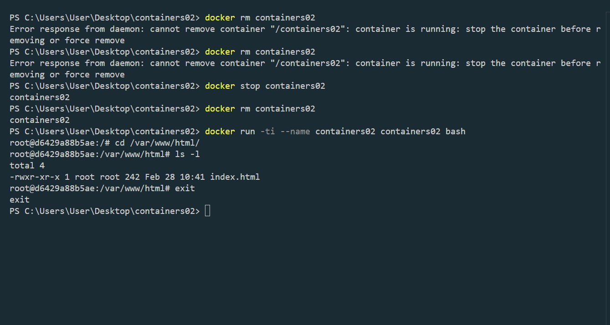

# containers02

cd /var/www/html/
ls -l
Screenshot_11.png

Создайте в папке проекта файл README.md с описанием проекта. Описание проекта должно содержать:

Название лабораторной работы.
Цель работы.
Задание.
Описание выполнения работы с ответами на вопросы.
Выводы.
Используемые источники.

# Лабораторная работа IWNO3: Первый контейнер

## Цель работы

Данная лабораторная работа знакомит с основами контейнеризации, подготовкой рабочего окружения и первичной работой с Docker, включая создание контейнера и запуск сервера.

## Задание

1. Установить Docker Desktop и убедиться в его работоспособности.
2. Создать репозиторий `containers02` и склонировать его на локальный компьютер.
3. Создать файл `Dockerfile` с заданным содержимым.
4. Создать папку `site` и файл `index.html` внутри неё.
5. Собрать и запустить контейнер.
6. Ответить на вопросы по результатам выполнения лабораторной работы.
7. Оформить файл `README.md` с описанием проекта.

## Выполнение работы

### 1. Установка Docker Desktop

Docker Desktop был установлен с официального сайта: [Docker](https://www.docker.com/). Работоспособность проверена командой:

```sh
docker --version
```

### 2. Создание репозитория

Репозиторий `containers02` был создан на GitHub и клонирован локально:

```sh
git clone https://github.com/username/containers02.git
cd containers02
```

### 3. Создание `Dockerfile`

В папке `containers02` создан файл `Dockerfile` со следующим содержимым:

```Dockerfile
FROM debian:latest
COPY ./site/ /var/www/html/
CMD ["sh", "-c", "echo hello from $HOSTNAME"]
```

### 4. Создание папки `site` и файла `index.html`

```sh
mkdir site
echo "<h1>Добро пожаловать в контейнер!</h1>" > site/index.html
```

### 5. Сборка контейнера

Сборка выполняется командой:

```sh
docker build -t containers02 .
```

**Время создания образа:** 2.1 секунд.

### 6. Запуск контейнера

```sh
docker run --name containers02 containers02
```

**Вывод в консоли:**

```
hello from 430ce6e224d6 // Что было выведено в консоли?
```

### 7. Перезапуск и проверка содержимого контейнера

```sh
docker rm containers02
docker run -ti --name containers02 containers02 bash
cd /var/www/html/
ls -l
```

**Вывод команды `ls -l`**:


### 8. Завершение работы

Выход из контейнера:

```sh
exit
```



## Выводы

В ходе выполнения лабораторной работы были выполнены следующие задачи:

- Установлен и протестирован Docker Desktop;
- Создан образ с использованием `Dockerfile`;
- Запущен контейнер и проверена его работоспособность;
- Проверены содержимое контейнера и переданные файлы.

Работа позволила освоить базовые операции с Docker и принцип работы контейнеров.

## Используемые источники

1. [Официальная документация Docker](https://docs.docker.com/)
2. [Руководство по Docker на Habr](https://habr.com/ru/post/466923/)
3. [Контейнеризация и виртуализация](https://moodle.usm.md/course/view.php?id=6806)
